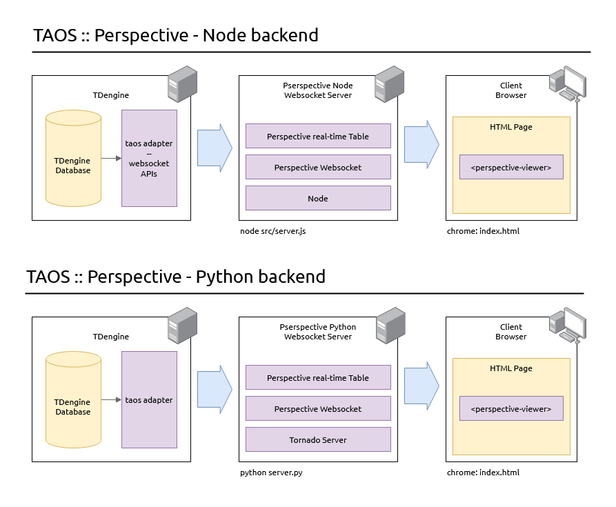

# TDengine <> Perspective - Python Backend

This guide demonstrates how to integrate [TDengine](https://tdengine.com/), a high-performance time-series database, with [Perspective](https://perspective.finos.org/), a powerful data visualization library. By combining these technologies, you can create a real-time data visualization platform that streams data from TDengine to an interactive real-time Perspective dashboard.

 

[TDengine](https://tdengine.com/) is a purpose-built time-series database optimized for Industrial IoT (IIoT) applications. TDengine excels in handling massive datasets generated by sensors, devices, and other time-series sources. Its efficient architecture supports real-time analytics, predictive maintenance, and AI/ML workflows, making it an ideal choice for industries requiring scalable and reliable data solutions. With features like data compression, high throughput, and seamless integration with modern tools, TDengine is one of the dominant choices for time-series data.

[Perspective](https://perspective.finos.org/) is a powerful data visualization library that enables interactive, real-time data analysis in web applications. Developed by [Prospective.co](https://prospective.co), Perspective leverages WebAssembly and Web Workers to provide high-performance data visualization capabilities directly in the browser. With Perspective, you can create dynamic dashboards, charts, and tables that update in real-time, allowing users to explore and interact with data seamlessly. Perspective's flexibility, speed, and ease of use make it an excellent choice for building data-driven applications that require real-time data visualization and analysis.

 

Together with TDengine and Perspective users can build high-performance -- milliseconds response time -- real-time data analysis and visualization applications on IoT data sources.

 

## Client Libraries: Connecting to Real-time data

Both TDengine and Perspective provide a vast library of client libraries (Node, Python, Rust, ...). In this document we provide two examples using both [Node](./node/README.md) and [Python](./python/README.md) backend. 

In both examples:

1. A producer (node or python) generates and inserts time-series data into a TDengine table.
2. A backend consumer relays data from TDengine (using python or node) to a real-time Perspective table
3. Perspective server broadcasts data to clients
4. Clients use `<perspective-viewer>` on the browser to view and interact with real-time data.

  

## Node

To setup TDengine and Perspective wiht a node backend, please follow [these](./node/README.md) instructions.

 

## Python

To setup TDengine and Perspective wiht a node backend, please follow [these](./python/README.md) instructions.

 
