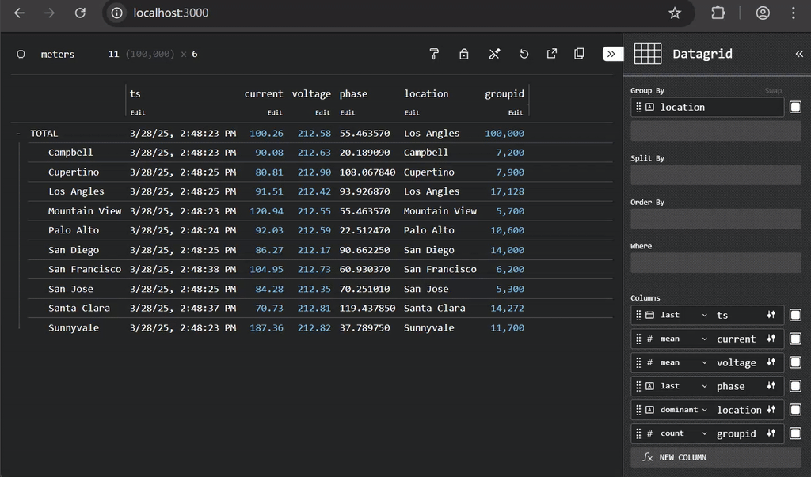
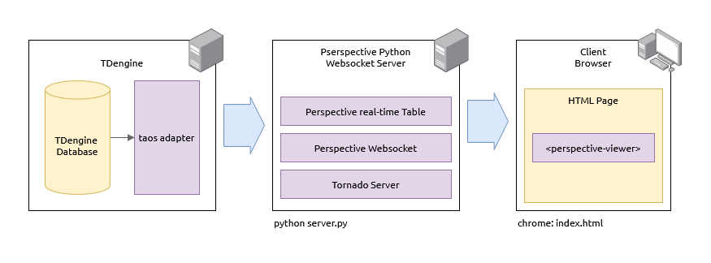

# TDengine <> Perspective - Node.js Backend

This guide demonstrates how to integrate [TDengine](https://tdengine.com/), a high-performance time-series database, with [Perspective](https://perspective.finos.org/), a powerful data visualization library. By combining these technologies, you can create a real-time data visualization platform that streams data from TDengine to an interactive real-time Perspective dashboard.

[](https://www.loom.com/share/5aa9f1d435d6430c99efa02559d3cd6c?sid=54d0ffbe-1906-4513-ad05-1898c8cbbe2d)

<br/>

[TDengine](https://tdengine.com/) is a purpose-built time-series database optimized for Industrial IoT (IIoT) applications. TDengine excels in handling massive datasets generated by sensors, devices, and other time-series sources. Its efficient architecture supports real-time analytics, predictive maintenance, and AI/ML workflows, making it an ideal choice for industries requiring scalable and reliable data solutions. With features like data compression, high throughput, and seamless integration with modern tools, TDengine is one of the dominant choices for time-series data.

[Perspective](https://perspective.finos.org/) is a powerful data visualization library that enables interactive, real-time data analysis in web applications. Developed by [Prospective.co](https://prospective.co), Perspective leverages WebAssembly and Web Workers to provide high-performance data visualization capabilities directly in the browser. With Perspective, you can create dynamic dashboards, charts, and tables that update in real-time, allowing users to explore and interact with data seamlessly. Perspective's flexibility, speed, and ease of use make it an excellent choice for building data-driven applications that require real-time data visualization and analysis.

<br/>

Together with TDengine and Perspective users can build high-performance -- milliseconds response time -- real-time data analysis and visualization applications on IoT data sources.

<br/>



<br/>

## Getting Started

This guide will walk you through the following steps:
1. Connect to TDengine Cloud or start a TDengine database using Docker.
2. Install Node.js dependencies, including Vite.
3. Run a producer script to populate the TDengine database with real-time data.
4. Start the Perspective WebSocket server to query TDengine and serve data to the frontend.
5. Use Vite to host the frontend `index.html` and visualize the data in real-time.
6. Tear down all running processes.

> **Note:** To connect to _TDengine Cloud_, you will need to set your TDengine Cloud connection URL and credentials:
> 
> `export TDENGINE_CLOUD_URL=wss://YOUR_CLOUD_REGION.cloud.tdengine.com?token=YOUR_TDENGINE_CLOUD_TOKEN`

### Run

To run this demo:

```bash
git clone

cd tdengine-prospective
npm install

# Set TDengine Cloud connection URL 
# OR start the TDengine docker container
export TDENGINE_CLOUD_URL=wss://YOUR_CLOUD_REGION.cloud.tdengine.com?token=YOUR_TDENGINE_CLOUD_TOKEN
# ./docker.sh

# Run the producer script to populate TDengine with data
node src/producer.js

# Start the Perspective server
node src/server.js

# Host the frontend with Vite
npm run dev

# Open your browser to http://localhost:3000
```

<br/>

---

<br/>

## Details

### Step 1: Start TDengine Database

Either set the TDengine Cloud connection URL _OR_ start a TDengine database in a Docker container by running the provided `docker.sh` script:

```bash
export TDENGINE_CLOUD_URL=wss://YOUR_CLOUD_REGION.cloud.tdengine.com?token=YOUR_TDENGINE_CLOUD_TOKEN
./docker.sh
```

<br/>

This script will:
- Pull the latest TDengine Docker image.
- Start a new TDengine container.
- Optionally populate the database with benchmark data (use the `--benchmark` flag).

---

### Step 2: Install Node.js Dependencies

Ensure you have Node.js and npm installed. Then, install the required dependencies:

```bash
npm install
```

<br/>

This will install all dependencies listed in `package.json`, including:
- `@finos/perspective` for the Perspective backend.
- `@tdengine/websocket` for connecting to TDengine.
- `vite` for hosting the frontend.

---

### Step 3: Run the Producer Script

Run the producer script to create a TDengine database and table, and insert real-time power line records into the table at regular intervals:

```bash
node src/producer.cjs
```

<br/>


This script will:
1. Connect to the TDengine database.
2. Create a database and table if they don't already exist.
3. Insert synthetic power line records into the table at a fixed interval (ie: 250ms).

The scripts generates random powerline data to insert into the TDengine table:

Example snippet from `src/producer.js`:
```javascript
function generateData(num_rows = NUM_ROWS_PER_INTERVAL) {
    const results = [];
    for (let i = 0; i < num_rows; i++) {
        // Pick a random company
        const metaIdx = Math.floor(Math.random() * COMPANY_METADATA.length);
        const meta = COMPANY_METADATA[metaIdx];

        // Generate price bars and metrics
        const [lowRange, highRange] = meta.price_range;
        const open = +(Math.random() * (highRange - lowRange) + lowRange).toFixed(2);
        const high = +(open * (1 + Math.random() * 0.03)).toFixed(2);
        const low = +(open * (0.97 + Math.random() * 0.03)).toFixed(2);
        const close = +(Math.random() * (high - low) + low).toFixed(2);

        const avgVol = meta.avg_volume;
        const volume = Math.max(1, Math.round(_randomDistribution(avgVol, avgVol * 0.15)));
        const lotSize = Math.floor(Math.random() * (500 - 50)) + 50;
        const trade_count = Math.floor(volume / lotSize);
        const notional = +(close * volume).toFixed(2);

        const index_fund = meta.index_fund[Math.floor(Math.random() * meta.index_fund.length)];
        const client = CLIENTS[Math.floor(Math.random() * CLIENTS.length)];
        const country = "United States";
        const trade_date = (new Date()).toISOString().slice(0, 10);
        const last_update = _nowISO();

        results.push({
            ticker: meta.ticker,
            sector: meta.sector,
            // ...
        });
    }
    return results;
}
```

It then inserts the data into the table using the TDengine WebSocket batch API:

```javascript
async function toasInsertData(conn, data, databaseName = TAOS_DATABASE, tableName = TAOS_TABLENAME) {
    try {
        const sql = `
            INSERT INTO ${databaseName}.${tableName} 
            (ts, ticker, sector, state, index_fund, open, high, low, close, volume, trade_count, notional, client, country, trade_date, last_update)
            VALUES (?, ?, ?, ?, ?, ?, ?, ?, ?, ?, ?, ?, ?, ?, ?, ?)
        `;

        let stmt = await conn.stmtInit();
        await stmt.prepare(sql);

        let bindParams = stmt.newStmtParam();
        bindParams.setTimestamp(data.map(row => new Date(row.last_update).getTime()));
        bindParams.setVarchar(data.map(row => row.ticker));
        // ...

        await stmt.bind(bindParams);
        await stmt.batch();
        await stmt.exec();
        console.log(`Inserted ${data.length} rows into table: ${databaseName}.${tableName}`);
    } catch (err) {
        console.error(`Failed to insert rows into ${tableName}, ErrCode: ${err.code}, ErrMessage: ${err.message}`);
        throw err;
    }
}
```

---

### Step 4: Start the Perspective WebSocket Server

The backend server (`src/server.js`) performs the following tasks:
1. Connects to the TDengine database.
2. Starts a Perspective WebSocket server on `ws://localhost:8080/websocket`.
3. Creates a Perspective table to store queried data.
4. Periodically queries TDengine and updates the Perspective table.

Run the server with:

```bash
node src/server.js
```

<br/>

This script constructs a Perspective WebSocket server and a Perspective Table:

```javascript
const perspective = require("@finos/perspective-node");
const { taosQuery } = require("./tdengine_query"); // Example: your TDengine query function

const PRSP_TABLE_NAME = "market";
const PRSP_TABLE_LIMIT = 10000;

const ws = new perspective.WebSocketServer({ port: 8080 });

async function prspCreatePerspectiveTable() {
    // Create a table with schema matching the market data
    const schema = {
        ts: "datetime",
        ticker: "string",
        sector: "string",
        state: "string",
        index_fund: "string",
        open: "float",
        high: "float",
        low: "float",
        close: "float",
        volume: "integer",
        trade_count: "integer",
        notional: "float",
        client: "string",
        country: "string",
        trade_date: "datetime",
        last_update: "datetime"
    };
    // Create a table with schema and row limit
    const table = await perspective.table(schema, { name: PRSP_TABLE_NAME, limit: PRSP_TABLE_LIMIT, index: "ts" });
    return table;
}

(async () => {
    const table = await prspCreatePerspectiveTable();
    ws.host_table(PRSP_TABLE_NAME, table);

    setInterval(async () => {
        const data = await taosQuery(); // Should return an array of market data objects
        await table.update(data);
    }, 250); // Refreshes the Perspective table every 250ms
})();
```

It then queries the TDengine table and updates the Perspective Table on an interval:

```javascript
setInterval(async () => {
    const data = await taosQuery(conn);
    await table.update(data);
}, 250); // Refreshes the Perspective table every 250ms
```

---

### Step 5: Host the Frontend with Vite

Use Vite to host the frontend `index.html`:

```bash
npm run dev
```

<br/>

Vite will:
- Transpile and bundle the Perspective libraries.
- Serve the `index.html` file on a local development server.

---

### Step 6: Visualize Data in the Browser

Open the Vite development server URL (e.g., `http://localhost:3000`) in your browser. The `index.html` file uses `<perspective-viewer>` to display the data.

<br/>


#### How `index.html` Works:
1. Imports Perspective libraries from CDNs:
   ```html
   <script type="module">
       import "https://cdn.jsdelivr.net/npm/@finos/perspective@3.4.3/dist/cdn/perspective.js";
   </script>
   ```
2. Connects to the Perspective WebSocket server:
   ```javascript
   const websocket = await perspective.websocket("ws://localhost:8080/websocket");
   const table = await websocket.open_table("meters");
   viewer.load(table);
   ```
3. Configures the viewer with a default view:
   ```javascript
   viewer.restore({
       plugin: "Datagrid",
       group_by: ["ticker"],
       columns: ["last_update",
                "open",
                "high",
                "low",
                "volume",
                "trade_count",
                "notional",
                "sector",],
       aggregates: { last_update: "last", open: "mean",
                    high: "mean", low: "mean", volume: "sum",
                    trade_count: "sum", notional: "sum", sector: "distinct" },
   });
   ```

---

### Step 7: Tear Down

To stop all running processes:
1. `producer.cjs`
2. `server.js`
3. Vite dev server
4. Docker container: `docker rm -vf prsp-tdengine`

---

### Step 8: Important Notes

- **Always** use the latest version of Perspective libraries. Check the [**Perspective releases**](https://github.com/finos/perspective/releases) for the latest version.
- This example is using Perspective version `3.4.3`.
- Ensure all ports (eg. `8080` for the WebSocket server, `3000` for Vite) are available before running the demo.

<br/><br/>


### Conclusion

By integrating TDengine with Perspective, you can build a robust, high-performance platform for real-time data visualization and analysis. This guide has demonstrated how to set up a complete pipeline, from data generation and storage in TDengine to real-time visualization in Perspective. With these tools, you can efficiently handle time-series data and create interactive dashboards tailored to your specific needs. Explore further customization and scaling options to adapt this setup for production environments.